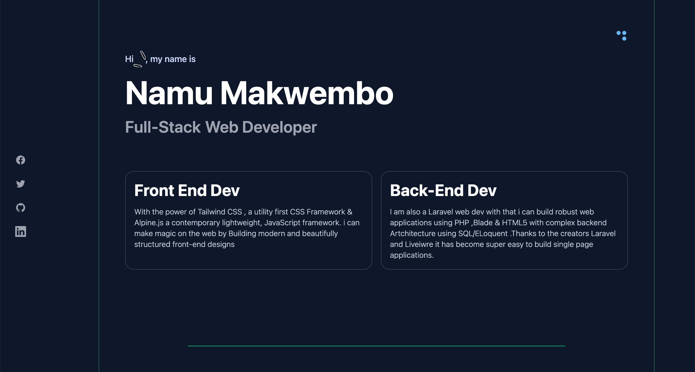

# Clinic template

Tall-Stack ❤️

The  Hotel Landing page is Built on top of the latest Tailwind CSS 3.0 framework and Alpine js library. It includes all of the needed features to build your startup quickly .Fully responsive and suitable to work on all devices ,not only that but we also added a dark mode theme to give your visitors the best user experience 

>This template is Framework Free built with Pure HTML-5 ,Tailwind CSS and Alpine.js so as to give developers a universal starting point

> * * * * * * * * * * * * * * * * * * * * * 

 

> #### Stack 

* Tailwind CSS V3
* ALpine JavaScript
* HTML 5

 

> #### Resources

* [Heroicons](https://heroicons.com)
* [Unsplash](https://unsplash.com)

 

> #### Features

*  Fully responsive
*  On-hover effects
*  Dark theme
*  1 Pages

 

> #### Credits

[Namu Makwembo](https://twitter.com/thee_king_yodah)

 

> #### License

You are free to use this template for personal and  commercial purposes. This free license will also give you access to updated versions of this template.

@copyright Rubdui.com 2022

